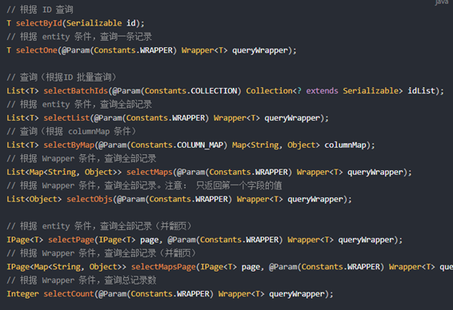

# MybatisPlus

目标：

- 了解mybatisplus以及其特点
- 能够掌握mybatisplus快速入门
- 能够掌握mybatisplus常用注解
- 能够掌握mybatisplus常用的增删改查
- 能够掌握mybatisplus自动代码生成

## 1. 概述

•MyBatis-Plus（简称 MP）是一个 MyBatis 的增强工具，在 MyBatis 的基础上只做增强不做改变，为简化开发、提高效率而生。

•官网：https://mybatis.plus/ 或 https://mp.baomidou.com/ 


版本

```xml
<dependency>
    <groupId>com.baomidou</groupId>
    <artifactId>mybatis-plus</artifactId>
    <version>3.4.0</version>
</dependency>
```

## 2. 快速入门

SpringBoot 整合 MyBatis-Plus，并实现根据Id查询功能。

```
①数据库环境准备
②创建SpringBoot工程，引入MyBatis-Plus起步依赖
③编写DataSource相关配置
④编写mapper
⑤测试
```

### 2.1 数据库环境准备

```mysql
-- 创建数据库
CREATE DATABASE mp;
USE mp;

-- 创建测试表
CREATE TABLE `tb_user` (
  `id` BIGINT(20) NOT NULL AUTO_INCREMENT COMMENT '主键ID',
  `user_name` VARCHAR(20) NOT NULL COMMENT '用户名',
  `password` VARCHAR(20) NOT NULL COMMENT '密码',
  `name` VARCHAR(30) DEFAULT NULL COMMENT '姓名',
  `age` INT(11) DEFAULT NULL COMMENT '年龄',
  `email` VARCHAR(50) DEFAULT NULL COMMENT '邮箱',
  PRIMARY KEY (`id`)
) ENGINE=INNODB AUTO_INCREMENT=1 DEFAULT CHARSET=utf8;

-- 插入测试数据
INSERT INTO `tb_user` (`id`, `user_name`, `password`, `name`, `age`, `email`) VALUES ('1', 'zhangsan', '123456', '张三', '18', 'test1@qq.cn');
INSERT INTO `tb_user` (`id`, `user_name`, `password`, `name`, `age`, `email`) VALUES ('2', 'lisi', '123456', '李四', '20', 'test2@qq.cn');
INSERT INTO `tb_user` (`id`, `user_name`, `password`, `name`, `age`, `email`) VALUES ('3', 'wangwu', '123456', '王五', '28', 'test3@qq.cn');
INSERT INTO `tb_user` (`id`, `user_name`, `password`, `name`, `age`, `email`) VALUES ('4', 'zhaoliu', '123456', '赵六', '21', 'test4@qq.cn');
INSERT INTO `tb_user` (`id`, `user_name`, `password`, `name`, `age`, `email`) VALUES ('5', 'sunqi', '123456', '孙七', '24', 'test5@qq.cn');

```

### 2.2 创建SpringBoot工程，引入MyBatis-Plus起步依赖

```xml
 <parent>
        <groupId>org.springframework.boot</groupId>
        <artifactId>spring-boot-starter-parent</artifactId>
        <version>2.3.4.RELEASE</version>
        <relativePath/> <!-- lookup parent from repository -->
    </parent>

    <properties>
        <project.build.sourceEncoding>UTF-8</project.build.sourceEncoding>
        <maven.compiler.source>1.8</maven.compiler.source>
        <maven.compiler.target>1.8</maven.compiler.target>
        <mysql.version>8.0.16</mysql.version>
    </properties>

    <dependencies>
        <dependency>
            <groupId>org.springframework.boot</groupId>
            <artifactId>spring-boot-starter</artifactId>
        </dependency>
        <dependency>
            <groupId>mysql</groupId>
            <artifactId>mysql-connector-java</artifactId>
            <version>${mysql.version}</version>
        </dependency>
        <dependency>
            <groupId>org.projectlombok</groupId>
            <artifactId>lombok</artifactId>
            <version>1.18.8</version>
            <scope>provided</scope>
        </dependency>
        <dependency>
            <groupId>org.springframework.boot</groupId>
            <artifactId>spring-boot-starter-test</artifactId>
            <scope>test</scope>
        </dependency>
        <!--mybatisplus起步依赖-->
        <dependency>
            <groupId>com.baomidou</groupId>
            <artifactId>mybatis-plus-boot-starter</artifactId>
            <version>3.4.0</version>
        </dependency>
    </dependencies>
    </dependencies>
```

### 2.3 编写DataSource相关配置

```yml
# datasource
spring:
  datasource:
    url: jdbc:mysql://localhost/mp?useUnicode=true&characterEncoding=UTF-8&serverTimezone=UTC
    username: root
    password: root
    driver-class-name: com.mysql.cj.jdbc.Driver
```

### 2.4  编码

编写mapper

```java
/**
 * 使用mp定义Mapper，需要让Mapper接口继承 BaseMapper接口。
 */

public interface UserMapper extends BaseMapper<User> {
}
```

实体类

```java
@Data
@NoArgsConstructor
@AllArgsConstructor
@Builder
@TableName("tb_user")
public class User {
    @TableId(type = IdType.AUTO)  // 主键采用自增方式；
    private Long id;
    private String userName;
    private String password;
    private String name;
    private Integer age;
    private String email;
}
```

启动类增加  @MapperScan 注解

```java
@MapperScan("org.byron4j.mapper")
@SpringBootApplication
public class MybatisPlusSpringbootApplication {
    public static void main(String[] args) {
        SpringApplication.run(MybatisPlusSpringbootApplication.class);
    }
}
```


### 2.5 测试

```java
@RunWith(SpringRunner.class)
@SpringBootTest
public class BaseTestCase {
}

public class UserMapperTest extends BaseTestCase{
    @Autowired
    private UserMapper userMapper;

    @Test
    public void 根据id查询() {
        User user = userMapper.selectById(1L);
        Assert.assertEquals(user.getUserName(), "zhangsan");
    }

    
}
```

## 3. CRUD

### 3.1 添加

#### 3.1.1 方法解析


#### 3.1.2 测试

```java
@Test
public void 插入(){
    int insert = userMapper.insert(User.builder()
                                   .age(20)
                                   .email("wb@qq.cn")
                                   .name("wb")
                                   .userName("wb")
                                   .password("123")
                                   .build());
    Assert.assertTrue(insert == 1);
}
```

#### 3.1.3  说明1, 实体类上的注解  @TableField

==**数据库字段使用_分割，实体类属性名使用驼峰名称，否则需要使用 @TableField("user_name") 指定映射关系**==

```java
1)  @TableField("user_name") 指定映射关系
实体类的属性名和数据库的字段名自动映射：
	 *  名称一样
	 *  数据库字段使用_分割，实体类属性名使用驼峰名称
   否则需要使用 @TableField("user_name") 指定映射关系
2)  忽略某个字段的查询和 插入
	  @TableField(exist = false) 
3)  设置id生成策略:AUTO 数据库自增
    @TableId(type = IdType.AUTO)
```

#### 3.1.4  说明2, 配置

```yml
mybatis-plus:
  global-config:
    db-config:
      # 表名前缀
      table-prefix: tb_
      # id生成策略 指定为数据库自增；默认是雪花算法
      id-type: auto
  configuration:
    # 日志
    log-impl: org.apache.ibatis.logging.stdout.StdOutImpl
```

#### 3.1.5 具体使用如下

```java
/**
 * 实体类的属性名和数据库的字段名自动映射：
 *  1. 名称一样
 *  2. 数据库字段使用_分割，实体类属性名使用驼峰名称
 */
@Data
@NoArgsConstructor
@AllArgsConstructor
@Builder
@TableName("tb_user")
public class User {


    //设置id生成策略:AUTO 数据库自增
    @TableId(type = IdType.AUTO)
    private Long id;
    //@TableField("user_name")
    private String userName;

    private String password;
    private String name;
    private Integer age;
    private String email;

    //不希望该值存入数据库
   // @TableField(exist = false)
   // private String info;

}

```

### 3.2 删除


#### 3.2.1 根据id删除

```java
@Test
public void 删除(){
    int byId = userMapper.deleteById(6);
    Assert.assertTrue(1 == byId);
}
```

#### 3.2.1 根据id集合批量删除

```java
@Test
public void 批量删除(){
    int batchIds = userMapper.deleteBatchIds(Arrays.asList(new Integer[]{1, 2}));
    Assert.assertTrue(2 == batchIds);
}
```

#### 3.2.1 根据map构造条件，删除

```java
@Test
public void map条件删除(){
    Map<String,Object> map = new HashMap<>();
    map.put("user_name", "wangwu");

    int deleteByMap = userMapper.deleteByMap(map);
    Assert.assertTrue(1 == deleteByMap);
}
```

### 3.3 更新


```java
@Test
public void 更新(){
    int update = userMapper.updateById(User.builder().id(4L).name("周六").build());
    Assert.assertTrue(1 == update);
}
```

## 4 查询



### 4.1 分页查询

配置 拦截器

```java
@Configuration
public class PageConfig {

    /**
     * 3.4.0之前的版本用这个
     * @return
     */
   /* @Bean
    public PaginationInterceptor paginationInterceptor(){
        return  new PaginationInterceptor();
    }*/

    /**
     * 3.4.0之后提供的拦截器的配置方式; PaginationInterceptor 已被废弃
     * @return
     */
   @Bean
   public MybatisPlusInterceptor mybatisPlusInterceptor(){
       MybatisPlusInterceptor mybatisPlusInterceptor = new MybatisPlusInterceptor();
       mybatisPlusInterceptor.addInnerInterceptor(new PaginationInnerInterceptor());
       return mybatisPlusInterceptor;
   }
}
```

查询

```java
/**
     * 分页查询：
     *  1. 当前页码：currentPage
     *  2. 每页显示条数：size
     *
     *  注意：使用mp的分页要设置一个拦截器！
            */
@Test
public void 分页查询(){
    IPage page = new Page(2, 5);
    IPage page1 = userMapper.selectPage(page, new QueryWrapper<>());
    Assert.assertTrue(page1 == page);
    Assert.assertTrue(page.getRecords().size() == 5);
}
```

### 4.2 条件构造器查询

```java
/**
 * 基础比较查询
 *
 * Wrapper:
 *  1.QueryWrapper
 *      LambdaQueryWrapper
 *  2.UpdateWrapper
 *      LambdaUpdateWrapper
 *
 */
```

#### 4.2.1 基础查询

通过 QueryWrapper 指定查询条件

```
eq( ) :  等于 =
ne( ) :  不等于 <>
gt( ) :  大于 >
ge( ) :  大于等于  >=
lt( ) :  小于 <
le( ) :  小于等于 <=
between ( ) :  BETWEEN 值1 AND 值2 
notBetween ( ) :  NOT BETWEEN 值1 AND 值2 
in( ) :  in
notIn( ) ：not in
```


```java
@Test
public void QueryWrapper(){
    QueryWrapper<User> queryWrapper = new QueryWrapper<>();
    queryWrapper
        .select("name", "password", "email")
        .ge("age", 18)
        .in("name", "张三", "李四");
    // SELECT name,password,email FROM tb_user WHERE (age >= ? AND name IN (?,?))
    List<User> users = userMapper.selectList(queryWrapper);
    System.out.println(users);
}
```


#### 4.2.2 逻辑查询 or

```
or( ) ：让紧接着下一个方法用or连接 
```


```java
@Test
    public void testWrapper2(){
        //1.创建查询条件构建器
        QueryWrapper<User> wrapper = new QueryWrapper<>();
        //2.设置条件
        wrapper.eq("user_name","lisi")
                .or()
                .lt("age",23)
                .in("name","李四","王五");
        /*
            select * from tb_user where user_name = ? or age < ? and name in (?,?)
         */
        List<User> users = userMapper.selectList(wrapper);
        System.out.println(users);
    }
```

#### 4.2.3 模糊查询 like

```
like
notLike
likeLeft
likeRight
```


```java
/**
     * 模糊查询
     */
    @Test
    public void testWrapper3(){
        //1.创建查询条件构建器
        QueryWrapper<User> wrapper = new QueryWrapper<>();
        //2.设置条件
        wrapper.likeLeft("user_name","zhang");
        /*
            SELECT id,user_name,password,name,age,email
             from tb_user
             where user_name like ?
             %zhang
         */
        List<User> users = userMapper.selectList(wrapper);
        System.out.println(users);
    }
```


#### 4.2.4  排序查询

```
orderBy
orderByAsc
orderByDesc
```


```java
@Test
    public void testWrapper4(){
        //1.创建查询条件构建器
        QueryWrapper<User> wrapper = new QueryWrapper<>();
        //2.设置条件
        wrapper.eq("user_name","lisi")
                .or()
                .lt("age",23)
                .in("name","李四","王五")
                //.orderBy(true,true,"age")
                .orderByDesc("age");
        /*
            select * from tb_user where user_name = ? or age < ? and name in (?,?) order by age asc
         */
        List<User> users = userMapper.selectList(wrapper);
        System.out.println(users);
    }
```


#### 4.2.5  select：指定需要查询的字段

```java
@Test
    public void testWrapper5(){
        //1.创建查询条件构建器
        QueryWrapper<User> wrapper = new QueryWrapper<>();
        //2.设置条件
        wrapper.eq("user_name","lisi")
                .or()
                .lt("age",23)
                .in("name","李四","王五")
                //.orderBy(true,true,"age")
                .orderByDesc("age")
                .select("id","user_name");
        /*
            select id,user_name from tb_user where user_name = ? or age < ? and name in (?,?) order by age asc
         */
        List<User> users = userMapper.selectList(wrapper);
        System.out.println(users);
    }
```


#### 4.2.6  分页条件查询

```java
@Test
    public void testWrapper6(){

        int current = 1;//当前页码
        int size = 2;//每页显示条数
        //1. 构建分页对象
        Page<User> page = new Page<>(current,size);
        //2. 构建条件对象
        QueryWrapper<User> wrapper = new QueryWrapper();
        wrapper.lt("age",23);
        userMapper.selectPage(page,wrapper);
        List<User> records = page.getRecords();
        long total = page.getTotal();
        long pages = page.getPages();
        System.out.println(records);
        System.out.println(total);//2
        System.out.println(pages);//1

    }
```


#### 4.2.7  LambdaQueryWrapper：消除代码中的硬编码

```java
@Test
public void LambdaQueryWrapper(){
    LambdaQueryWrapper<User> lambdaQueryWrapper = new LambdaQueryWrapper();
    lambdaQueryWrapper
        .eq(User::getUserName, "zhangsan")
        .select(User::getUserName, User::getName, User::getPassword, User::getEmail)
        .orderByDesc(User::getAge);
    // SELECT user_name,name,password,email FROM tb_user WHERE (user_name = ?) ORDER BY age DESC
    List list = userMapper.selectList(lambdaQueryWrapper);
    System.out.println(list);
}
```


#### 4.2.8  条件 删除


```java
@Test
public void testWrapper8(){
    QueryWrapper<User> wrapper = new QueryWrapper<>();
    wrapper.eq("user_name","bbb");
    userMapper.delete(wrapper);
}
```


#### 4.2.9  条件 update


```java
@Test
public void testWrapper9(){
    UpdateWrapper<User> wrapper = new UpdateWrapper<>();
    //条件
    wrapper.eq("user_name","lisi")
        .set("password","22222");
    //update tb_user set password = ? where user_name = ?
    userMapper.update(null,wrapper);
}
@Test
public void testWrapper10(){
    UpdateWrapper<User> wrapper = new UpdateWrapper<>();
    //条件
    wrapper.eq("user_name","lisi");
    //update tb_user set password = ?,age = ? where user_name = ?
    User user = new User();
    user.setPassword("3333");
    user.setAge(33);
    userMapper.update(user,wrapper);
}


@Test
public void updateLambdaQueryWrapper(){
    LambdaUpdateWrapper<User> lambdaUpdateWrapper = new LambdaUpdateWrapper();
    lambdaUpdateWrapper
        .set(User::getPassword, "11111111")
        .ge(User::getAge, 35);
    // UPDATE tb_user SET password=? WHERE (age >= ?)
    userMapper.update(User.builder().build(), lambdaUpdateWrapper);
}
```

## 5 service 封装

Mybatis-Plus 为了开发更加快捷，对业务层也进行了封装，直接提供了相关的接口和实现类。我们在进行业务层开发时，可以继承它提供的接口和实现类，使得编码更加高效

```
- 1. 定义接口继承IService
- 2. 定义实现类继承ServiceImpl<Mapper，Entity> 实现定义的接口
```

接口

```java

public interface UserService  {
}
```

实现类封装

```java
@Service
public class UserServiceImpl extends ServiceImpl<UserMapper, User> implements UserService {}
```

测试

```java
@Autowired
private UserService userService;

@Test
public void 测试Service() {
    boolean save =
        userService.save(User.builder()
                         .userName("lb")
                         .name("李白")
                         .password("111111")
                         .build());
    Assert.assertTrue(save);
}
```


## 6. 逆向工程-代码生成器

AutoGenerator 是 MyBatis-Plus 的代码生成器，通过 AutoGenerator 可以快速生成 Entity、Mapper、Mapper XML、Service、Controller 等各个模块的代码，极大的提升了开发效率。

6.1 导入坐标

```xml
<!--mp 代码生成器-->
<dependency>
    <groupId>com.baomidou</groupId>
    <artifactId>mybatis-plus-generator</artifactId>
    <version>3.4.0</version>
</dependency>

<dependency>
    <groupId>org.freemarker</groupId>
    <artifactId>freemarker</artifactId>
    <version>2.3.30</version>
</dependency>
</dependencies>
```

#### 6.2 执行main  方法

官网示例

```java
package org.byron4j;

import com.baomidou.mybatisplus.core.exceptions.MybatisPlusException;
import com.baomidou.mybatisplus.core.toolkit.StringPool;
import com.baomidou.mybatisplus.core.toolkit.StringUtils;
import com.baomidou.mybatisplus.generator.AutoGenerator;
import com.baomidou.mybatisplus.generator.InjectionConfig;
import com.baomidou.mybatisplus.generator.config.*;
import com.baomidou.mybatisplus.generator.config.po.TableInfo;
import com.baomidou.mybatisplus.generator.config.rules.NamingStrategy;
import com.baomidou.mybatisplus.generator.engine.FreemarkerTemplateEngine;

import java.util.ArrayList;
import java.util.List;
import java.util.Scanner;

public class CodeGenerator {
    /**
     * <p>
     * 读取控制台内容
     * </p>
     */
    public static String scanner(String tip) {
        Scanner scanner = new Scanner(System.in);
        StringBuilder help = new StringBuilder();
        help.append("请输入" + tip + "：");
        System.out.println(help.toString());
        if (scanner.hasNext()) {
            String ipt = scanner.next();
            if (StringUtils.isNotBlank(ipt)) {
                return ipt;
            }
        }
        throw new MybatisPlusException("请输入正确的" + tip + "！");
    }

    public static void main(String[] args) {
        // 代码生成器
        AutoGenerator mpg = new AutoGenerator();

        // 全局配置
        GlobalConfig gc = new GlobalConfig();
        String projectPath = System.getProperty("user.dir");
        System.out.println(projectPath);
        gc.setOutputDir(projectPath + "/src/main/java");
        gc.setAuthor("byron4j");
        gc.setOpen(false);
        // gc.setSwagger2(true); 实体属性 Swagger2 注解
        mpg.setGlobalConfig(gc);

        // 数据源配置
        DataSourceConfig dsc = new DataSourceConfig();
        dsc.setUrl("jdbc:mysql:///mp?useUnicode=true&characterEncoding=UTF-8&serverTimezone=UTC");
        // dsc.setSchemaName("public");

        dsc.setDriverName("com.mysql.cj.jdbc.Driver");
        dsc.setUsername("root");
        dsc.setPassword("root");
        mpg.setDataSource(dsc);

        // 包配置
        PackageConfig pc = new PackageConfig();
        pc.setModuleName(scanner("模块名"));
        pc.setParent("org.byron4j");
        mpg.setPackageInfo(pc);

        // 自定义配置
        InjectionConfig cfg = new InjectionConfig() {
            @Override
            public void initMap() {
                // to do nothing
            }
        };

        // 如果模板引擎是 freemarker
        String templatePath = "/templates/mapper.xml.ftl";
        // 如果模板引擎是 velocity
        // String templatePath = "/templates/mapper.xml.vm";

        // 自定义输出配置
        List<FileOutConfig> focList = new ArrayList<>();
        // 自定义配置会被优先输出
        focList.add(new FileOutConfig(templatePath) {
            @Override
            public String outputFile(TableInfo tableInfo) {
                // 自定义输出文件名 ， 如果你 Entity 设置了前后缀、此处注意 xml 的名称会跟着发生变化！
                return projectPath + "/src/main/resources/mapper/" + pc.getModuleName()
                        + "/" + tableInfo.getEntityName() + "Mapper" + StringPool.DOT_XML;
            }
        });
        /*
        cfg.setFileCreate(new IFileCreate() {
            @Override
            public boolean isCreate(ConfigBuilder configBuilder, FileType fileType, String filePath) {
                // 判断自定义文件夹是否需要创建
                checkDir("调用默认方法创建的目录，自定义目录用");
                if (fileType == FileType.MAPPER) {
                    // 已经生成 mapper 文件判断存在，不想重新生成返回 false
                    return !new File(filePath).exists();
                }
                // 允许生成模板文件
                return true;
            }
        });
        */
        cfg.setFileOutConfigList(focList);
        mpg.setCfg(cfg);

        // 配置模板
        TemplateConfig templateConfig = new TemplateConfig();

        // 配置自定义输出模板
        //指定自定义模板路径，注意不要带上.ftl/.vm, 会根据使用的模板引擎自动识别
        // templateConfig.setEntity("templates/entity2.java");
        // templateConfig.setService();
        // templateConfig.setController();

        templateConfig.setXml(null);
        mpg.setTemplate(templateConfig);

        // 策略配置
        StrategyConfig strategy = new StrategyConfig();
        strategy.setNaming(NamingStrategy.underline_to_camel);
        strategy.setColumnNaming(NamingStrategy.underline_to_camel);
        //strategy.setSuperEntityClass("你自己的父类实体,没有就不用设置!");
        strategy.setEntityLombokModel(true);
        strategy.setRestControllerStyle(true);
        // 公共父类
        //strategy.setSuperControllerClass("你自己的父类控制器,没有就不用设置!");
        // 写于父类中的公共字段
        strategy.setSuperEntityColumns("id");
        strategy.setInclude(scanner("表名，多个英文逗号分割").split(","));
        strategy.setControllerMappingHyphenStyle(true);
        strategy.setTablePrefix(pc.getModuleName() + "_");
        mpg.setStrategy(strategy);
        mpg.setTemplateEngine(new FreemarkerTemplateEngine());
        mpg.execute();
    }
}

```


运行，控制台：

```
请输入模块名：
mp
请输入表名，多个英文逗号分割：
tb_user_back

```


